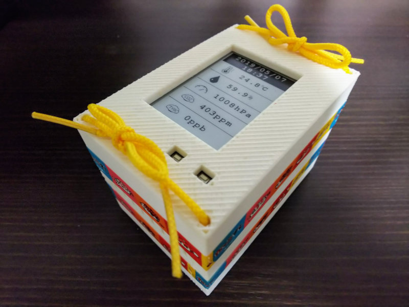
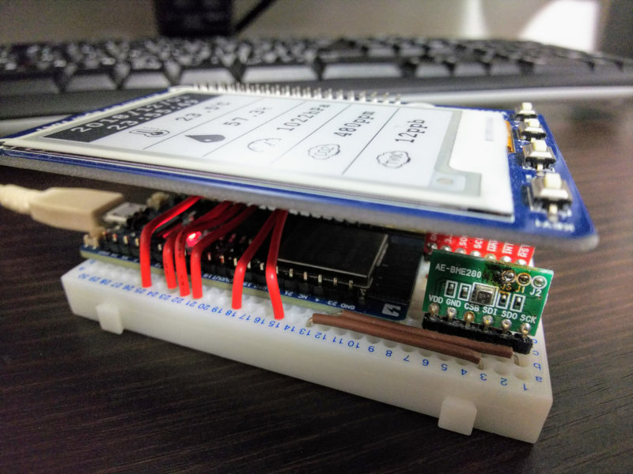
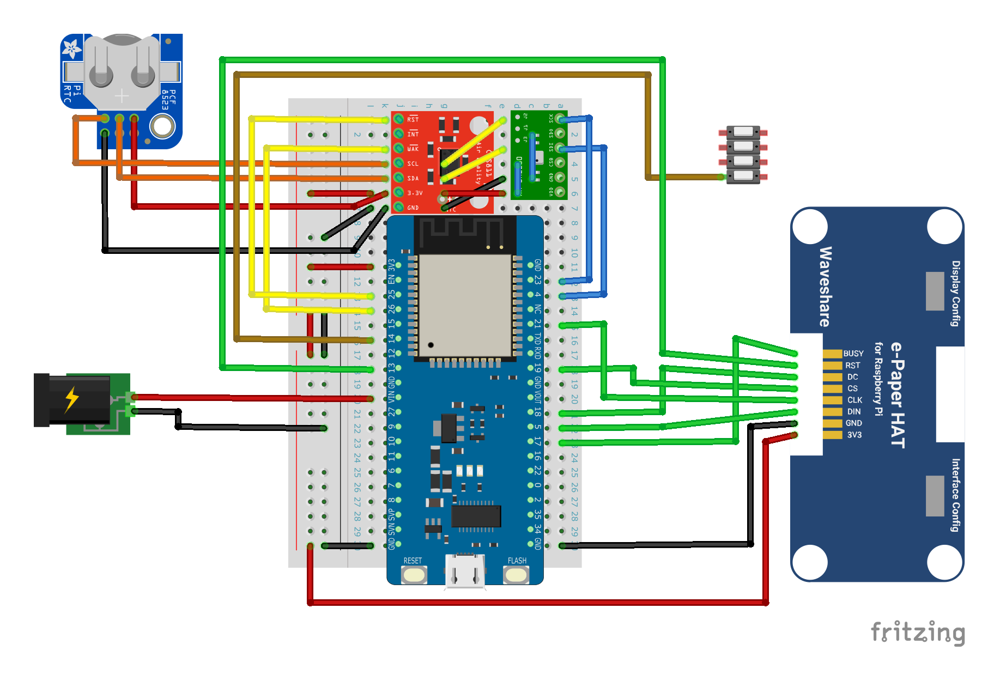

# MultiEnvironmentMonitor
小型で電源を搭載した環境観測装置。気温、湿度、気圧、CO₂濃度、TVOC濃度を記録し、Google Sheetsへ送信する機能を搭載。

  
  

## 開発記録

[⚡️「環境観測装置 制作記録」](https://twitter.com/i/events/1276877957097680896)

## 採用した技術
### ソフトウェア

- Arduino ([Arduino core for the ESP32](https://github.com/espressif/arduino-esp32))

### ハードウェア

- ESP32 ([スイッチサイエンス ESPr Developer 32](https://www.switch-science.com/catalog/3210/))
- BME280 ([秋月電子通商 BME280使用 温湿度・気圧センサモジュールキット](http://akizukidenshi.com/catalog/g/gK-09421))
- CCS811 ([スイッチサイエンス CCS811搭載 空気品質センサモジュール](https://www.switch-science.com/catalog/3298/))
- PCF8523 ([スイッチサイエンス PCF8523搭載 RTCモジュール](https://www.switch-science.com/catalog/3037/))
- WaveShare 2.7inch e-Paper ([千石電商 WaveShare 13354 2.7インチ 264×176 E-Ink 電子ペーパーモジュール for RaspberryPi](https://www.sengoku.co.jp/mod/sgk_cart/detail.php?code=EEHD-58WL))

